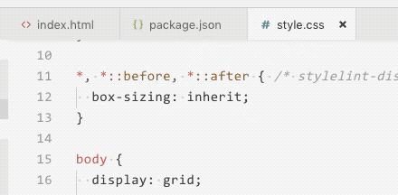

# TabCyclist

Cycle through your tabs like a slideshow

## Features

- Automatically focusses tab-by-tab in your current workspace.
- Timing interval is just a setting.

## Keyboard shortcuts

- `alt+c` start **c**ycling
- `alt+f` **f**inish cycling

## Extension Settings

This extension contributes the following settings:

- `tabcyclist.interval`: set to the desired interval in seconds

## Known Issues

It can be tricky to stop the cycling due the command palette loses focus. Check the **keyboard shortcuts**

## Attribution

- Cyclist icon used from [Twemoji](https://twemoji.twitter.com/)
